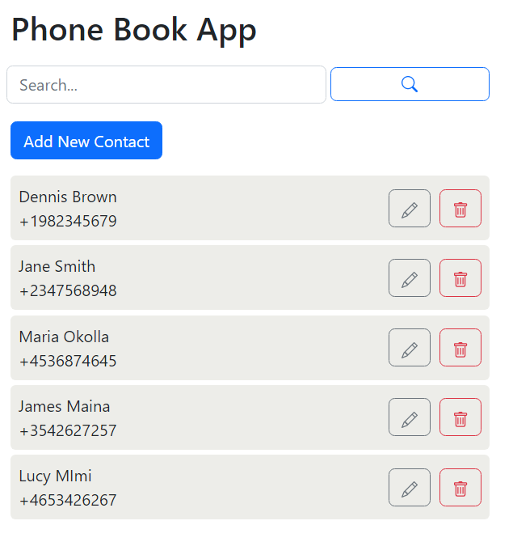
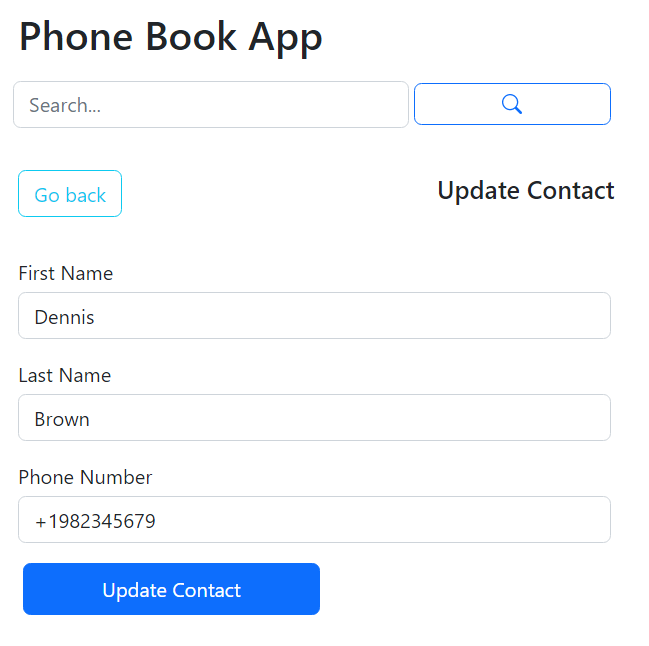
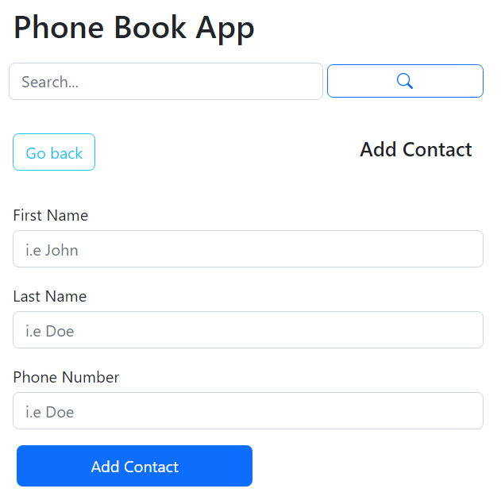

# Phone Book App

A simple CRUD MERN stack phone book application.

## Technology

- React
- Node
- Express
- MongoDB

## Views

  

  

  

## Setup

- Clone the project: `git@github.com:rOluochKe/phone-book.git`
- Change directory into both client and api separately: `cd /client` for client and `cd /api` for api
- Install the required dependencies for both client and api, run `npm install`
- Setup mongodb database and add url to `.env` file on the api root directory
- Test all endpoints in the api from the file `api/endpoints.http`
- Run both the applications simultaneously: client `npm start` and api `npm run dev`
- View the application on the browser using `http://localhost:3000`
